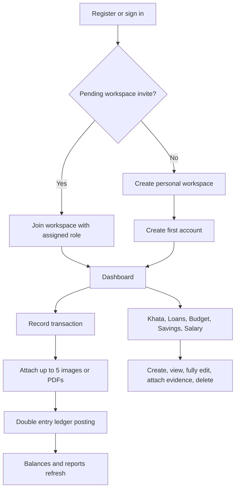
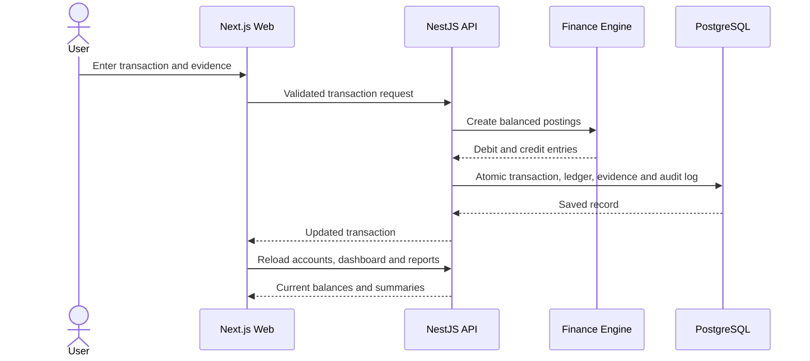
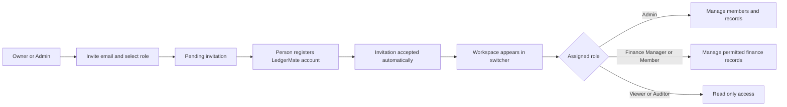
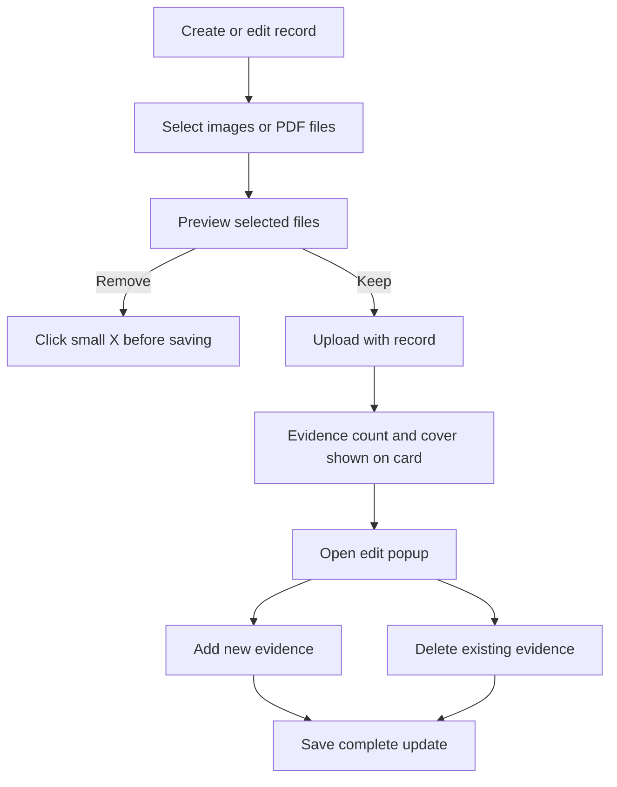
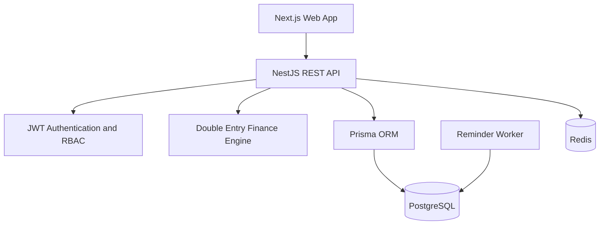

# LedgerMate 360

<p align="center">
  
</p>

<h3 align="center">Your money, khata, loans and savings — all in one place.</h3>

LedgerMate 360 is a multi tenant finance workspace for individuals, families and small teams. It combines everyday money records with a balanced ledger, Pakistani style khata, loan and salary tracking, budgets, savings goals, evidence files, reports, role based collaboration and audit history.

## Product capabilities

- Detailed registration, login, forgot password, password reset, profile photo and password change
- Multiple workspaces with Owner, Admin, Finance Manager, Member, Viewer and Auditor roles
- Pending email invitations: an admin can assign a role before the person creates an account
- Cash, bank, savings, wallet, credit, investment and custom accounts
- Income, expense, transfer, loan and savings transactions backed by balanced ledger entries
- Up to five images or PDFs on transaction and finance records
- Full edit popups for transactions, khata, loans, budgets, savings and salary profiles
- Khata people, photos, receivable/payable balances and entries
- Loan repayments, interest, due dates and status tracking
- Budget limits, live category spending, warning thresholds and evidence
- Savings goals, contributions, priorities and target dates
- Salary profiles with gross pay, net pay, tax, allowances and deductions
- Shared expense splitting and settlement
- Period based reports with category and account breakdowns
- CSV import preview and export
- Recurring records, notifications and a read only finance assistant
- Themes, dark mode, typography and layout density settings
- Tenant isolation, role checks, rate limiting, audit logs and health checks

## Main user flow



## Transaction and ledger flow



## Workspace roles and invitations



## Record evidence flow



## Architecture



## Quick start

Requirements: Node.js 20+ and Docker Desktop.

```bash
cp .env.example .env
docker compose up -d
npm install
npm run db:generate
npm run db:migrate
npm run db:seed
npm run dev
```

- Web: http://localhost:3000
- API: http://localhost:4000/api
- Swagger: http://localhost:4000/api/docs
- Health: http://localhost:4000/api/health

### Local demo login

- Email: `demo@ledgermate.local`
- Password: `LedgerMate@360`

Use demo credentials only for local development.

## Repository structure

```text
apps/web                 Next.js client and product UI
apps/api                 NestJS REST API and authorization
apps/worker              Recurring reminders and background jobs
packages/database        Prisma schema, migrations and database client
packages/finance-engine  Balanced posting rules
packages/types           Shared domain types
packages/validation      Shared Zod validation
```

## Delivery status

All seven planned phases are represented in the working application: core ledger, finance modules, collaboration and evidence, customization and reminders, finance assistant, plans/admin architecture, and production security/deployment foundations.

Additional technical documentation is available in [`docs/architecture.md`](docs/architecture.md), [`docs/finance-engine.md`](docs/finance-engine.md), [`docs/security.md`](docs/security.md) and [`docs/roadmap.md`](docs/roadmap.md).
