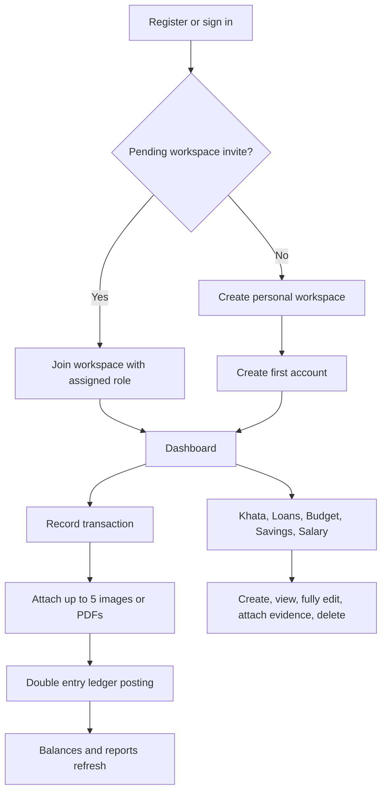
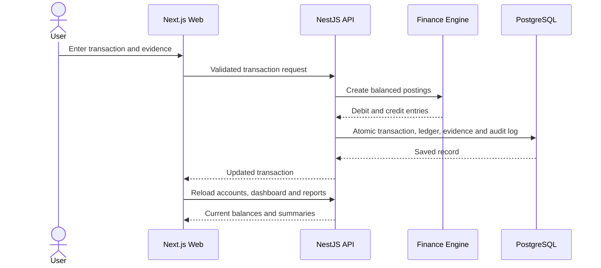
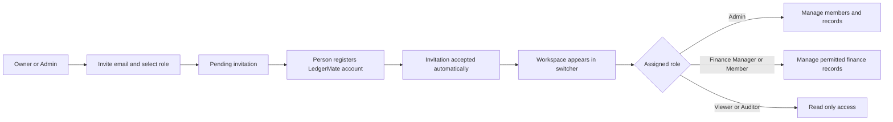
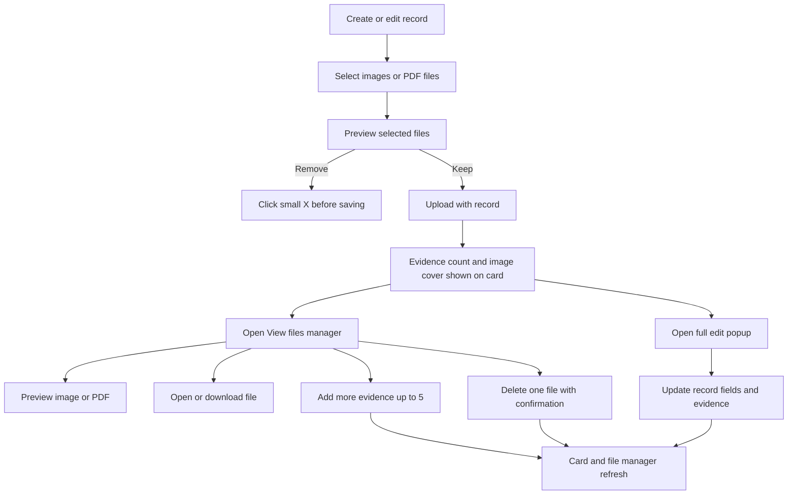
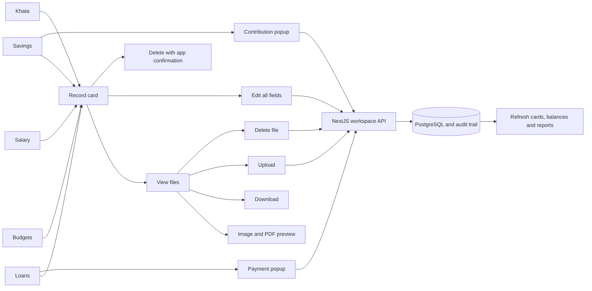
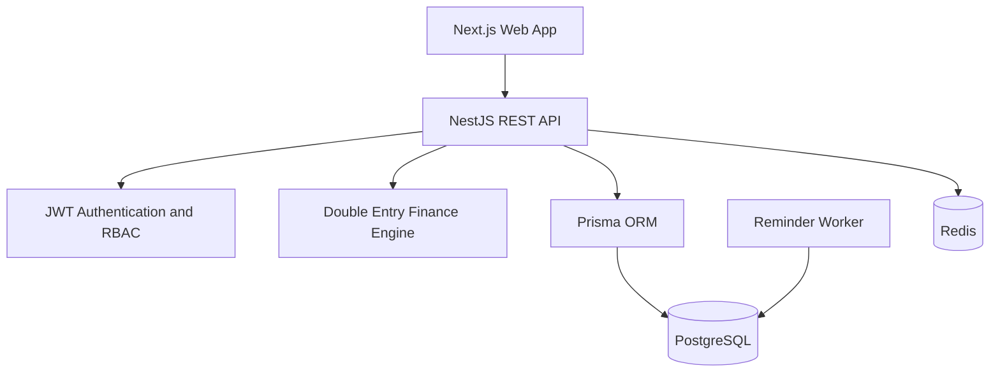
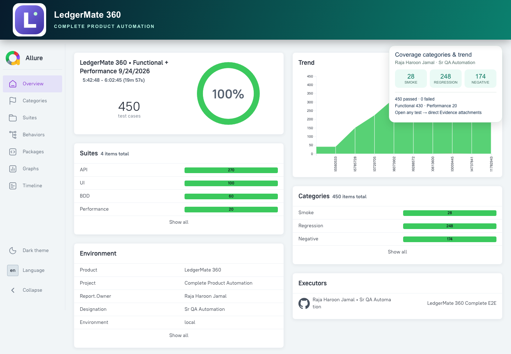
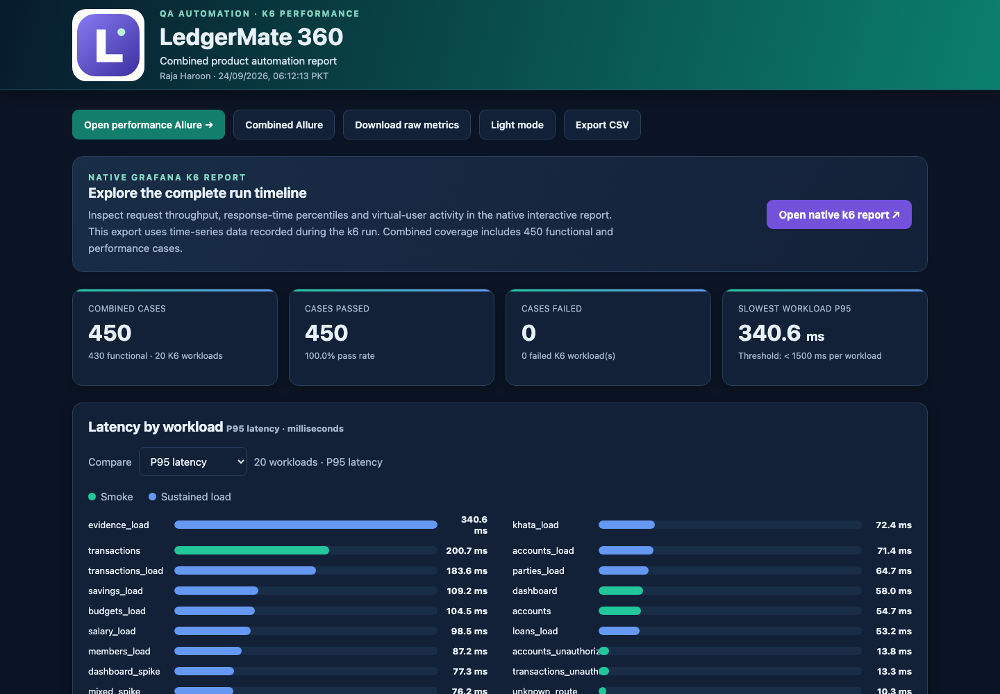
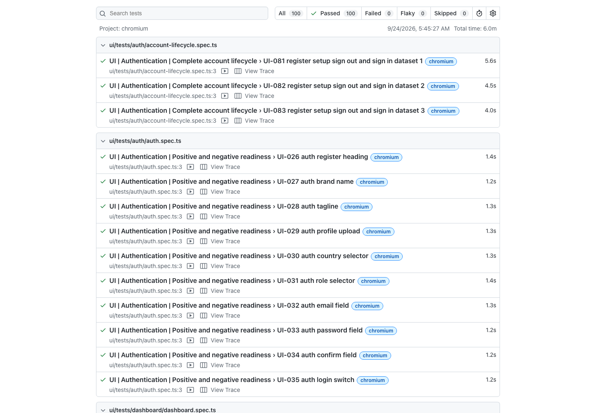
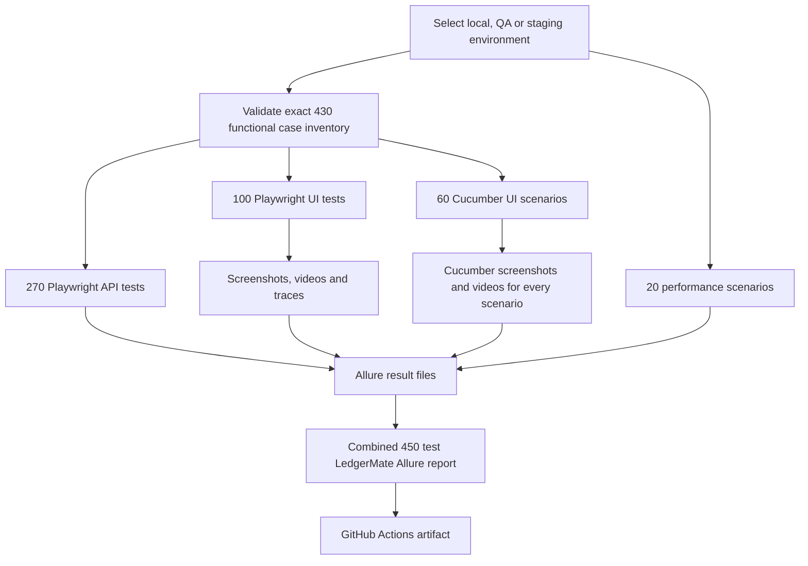

# LedgerMate 360

<p align="center">
  
</p>

<h3 align="center">Your money, khata, loans and savings — all in one place.</h3>

<p align="center">
  <strong>Next.js 15 · NestJS · PostgreSQL · Prisma · Playwright · Cucumber · Allure · k6</strong>
</p>

<p align="center">
  
  
  
  
</p>

LedgerMate 360 is a multi tenant finance workspace for individuals, families and small teams. It combines everyday money records with a balanced ledger, Pakistani style khata, loan and salary tracking, budgets, savings goals, evidence files, reports, role based collaboration and audit history.

## Current quality status

| Area | Coverage | Last complete run |
|---|---:|---:|
| API automation | 270 cases | 270 passed |
| Playwright UI | 100 cases | 100 passed |
| Cucumber BDD | 60 scenarios | 60 passed |
| Performance | 20 scenarios | 20 passed |
| Combined Allure | 450 results | 450 passed |
| Evidence | Screenshot, video and trace | Direct test attachments |
| Categories | Smoke, Regression and Negative | Trend enabled |

Fresh complete automation run on **24 September 2026**: **450/450 passed, 0 failed**. This combines 430 functional cases with 20 measured k6 workloads.

## Product capabilities

- Detailed registration, login, forgot password, password reset, profile photo and password change
- Multiple workspaces with Owner, Admin, Finance Manager, Member, Viewer and Auditor roles
- Pending email invitations: an admin can assign a role before the person creates an account
- Cash, bank, savings, wallet, credit, investment and custom accounts
- Income, expense, transfer, loan and savings transactions backed by balanced ledger entries
- Up to five images or PDFs on transaction and finance records, including salary profiles
- Card level file manager to preview, open, download, upload and delete evidence
- Full edit popups for transactions, khata, loans, budgets, savings and salary profiles
- Khata people, photos, receivable/payable balances and entries
- Loan repayments, interest, due dates and status tracking
- Budget limits, live category spending, warning thresholds and evidence
- Savings goals, contributions, priorities and target dates
- Salary profiles with gross pay, net pay, tax, allowances and deductions
- Shared expense splitting and settlement
- Period based reports with category and account breakdowns
- CSV import preview and export
- Recurring records, notifications and a read only finance assistant
- Themes, dark mode, typography and layout density settings
- Tenant isolation, role checks, rate limiting, audit logs and health checks

## Main user flow



## Transaction and ledger flow



## Workspace roles and invitations



## Record evidence flow



## Advanced finance record flow



Every finance card keeps its main actions together. **View files** manages supporting documents, **Edit** opens the complete record form, and **Delete** opens a LedgerMate confirmation dialog. Loan payments and savings contributions use validated amount popups instead of browser prompts.

## Architecture



## Quick start

Requirements: Node.js 20+ and Docker Desktop.

```bash
cp .env.example .env
docker compose up -d
npm install
npm run db:generate
npm run db:migrate
npm run db:seed
npm run dev
```

- Web: http://localhost:3000
- API: http://localhost:4000/api
- Swagger: http://localhost:4000/api/docs
- Health: http://localhost:4000/api/health

### Local demo login

- Email: `demo@ledgermate.local`
- Password: `LedgerMate@360`

Use demo credentials only for local development.

## Automated testing

```bash
npm test                 # Finance engine and workspace unit tests
npm run typecheck        # TypeScript checks across every package
npm run test:e2e         # Playwright API and Chromium browser tests
npm run test:api         # 270 API contract, security and CRUD flow cases
npm run test:ui          # 100 Playwright UI smoke, regression and E2E cases
npm run test:cucumber    # 60 Cucumber UI scenarios
npm run test:automation  # Validate and run all 430 functional cases
npm run test:e2e:ui      # Interactive Playwright test runner
npm run test:e2e:report  # Open the latest HTML test report
npm run allure:prepare   # Clean results and write environment, executor, categories and history
npm run allure:generate  # Build combined API, UI and Cucumber Allure report
npm run allure:open      # Open the generated Allure report
npm run performance:test # Run independent smoke, sustained-load and spike performance scenarios
npm run performance:k6   # Optional native k6 run of the 20-scenario workload
npm run performance:report # Generate the performance Allure report
npm run performance:open # Open the detailed performance dashboard
npm run reports:open     # Open functional Allure, performance Allure and performance dashboard
npm run test:complete    # Run 430 functional + 20 performance cases and generate every report
```

The dedicated [`automation`](automation) framework contains three independently runnable functional sections: 270 API tests, 100 Playwright UI tests and 60 Cucumber UI scenarios. The inventory guard fails if the functional total differs from 430. A fourth section runs 20 performance scenarios. It includes multiple data sets, positive and negative coverage, full CRUD journeys, account registration and sign-in lifecycle, PNG/PDF evidence uploads, environment profiles, API clients, test fixtures, Page Object Models, data factories, attachment helpers, smoke and regression tags, and separate report output.

```text
automation/
├── api/tests                 auth, security, contract and full CRUD API suites (270 cases)
├── api/support               authenticated API session hooks
├── ui/tests                  page, feature, auth lifecycle and finance E2E suites (100 cases)
├── cucumber/features         60 Gherkin scenarios
├── cucumber/steps            Cucumber Playwright steps and hooks
├── config                    JSON environment and framework configuration
├── test-data                 users, navigation and API contract JSON fixtures
├── core/config               typed environment and JSON data readers
├── core/clients              reusable API client
├── core/locators             independent locator maps for every page area
├── core/pages                reusable Page Objects with no test assertions hidden in selectors
├── core/fixtures             custom fixtures and automatic evidence hook
├── core/utils                seeded Faker factories and Allure attachments
├── performance              20 scenario Node runner, HTML report and optional k6 workload
├── scripts                   inventory validation and branded Allure metadata/report generation
└── reports                   Allure, HTML, screenshot, trace and video output
```

Set `TEST_ENV=local|qa|staging`, then provide the matching `QA_WEB_URL`, `QA_API_URL`, `STAGING_WEB_URL` and `STAGING_API_URL` values when required. `TEST_EMAIL` and `TEST_PASSWORD` override the automation account without changing code.

Playwright captures a screenshot, video and trace for every browser test. Cucumber attaches a full page screenshot and WebM video for every scenario. The report generator promotes evidence directly onto each test and removes Before Hooks and After Hooks sections. API payloads can be attached through the shared attachment helper. The report includes the LedgerMate logo and title, executor/build details, environment values, Smoke, Regression and Negative categories, suite hierarchy and retained trend history.

All functional results are tagged and grouped as Smoke, Regression or Negative coverage. The native k6 runner executes 20 smoke, sustained-load, negative-resilience and spike workloads. Each workload enforces P95 response time below 1500 ms, error rate below 1% and a 100% content-check pass rate. Performance results appear as a separate suite in the combined Allure report and in a dedicated branded HTML dashboard, alongside Grafana k6's interactive time-series report.

The Cucumber and performance commands automatically start missing local API/Web services, wait for health readiness, and stop only the processes they started. Performance load and acceptance gates can be changed without code: `PERF_USER_SCALE=5 PERF_ITERATION_SCALE=10 PERF_P95_MS=1000 PERF_ERROR_RATE=0.005 npm run performance:test`. The default profile stays lightweight for local and CI regression; higher scale values provide load and stress runs.

### Performance profiles

| Profile | Command | Purpose |
|---|---|---|
| Baseline | `npm run performance:test` | Fast local and CI regression |
| Load | `PERF_USER_SCALE=5 PERF_ITERATION_SCALE=10 npm run performance:test` | Sustained concurrent traffic |
| Stress | `PERF_USER_SCALE=10 PERF_ITERATION_SCALE=20 npm run performance:test` | Capacity and degradation checks |
| Native k6 | `K6_VUS=50 K6_ITERATIONS=500 npm run performance:k6` | Workload through an installed k6 engine |

Every performance scenario records virtual users, iterations, request count, throughput, minimum, average, P50, P95, P99, maximum, error rate and threshold status. `PERF_P95_MS` and `PERF_ERROR_RATE` control the pass gates.

### Generated reports

| Report | Location |
|---|---|
| Combined functional and performance Allure | `automation/reports/allure-report/index.html` |
| Dedicated performance Allure | `automation/reports/performance-allure-report/index.html` |
| Detailed performance dashboard | `automation/reports/performance/index.html` |
| Playwright HTML | `automation/reports/playwright-html/index.html` |

Run `npm run reports:open` to open all main reports. Report directories are ignored by Git and uploaded as GitHub Actions artifacts for 14 days.

The GitHub Actions workflow runs database migrations, type checks, unit tests, the production build, all 430 functional cases, all 20 performance scenarios, and combined Allure generation on every push to `main` and every pull request. Playwright, combined Allure and dedicated performance reports are uploaded together as a workflow artifact.

### Latest report screenshots

These screenshots were captured from the fresh 450/450 passing run above. The Allure report combines API, UI, BDD and performance results; the native Playwright report shows all 100 UI cases passing; the k6 dashboard includes measured workload latency and pass totals.

#### Combined Allure report



#### k6 performance dashboard



#### Playwright UI report



### Automation execution flow



### Administrator approved password recovery

```mermaid
sequenceDiagram
    actor User
    actor Admin
    participant Web as LedgerMate Web
    participant API as Auth API
    participant DB as PostgreSQL
    User->>Web: Submit forgot password email
    Web->>API: Create recovery request
    API->>DB: Store pending request for 24 hours
    API-->>User: Request sent for administrator approval
    Admin->>Web: Open Workspace Admin
    Web->>API: Load pending recovery requests
    Admin->>API: Approve selected request
    API->>DB: Activate secure token for 15 minutes
    API-->>Admin: Approved token for secure delivery
    User->>Web: Choose I have an approved token
    User->>API: Submit token and new password
    API->>DB: Update password and consume token
    API-->>User: Password updated; sign in
```

## Repository structure

```text
apps/web                 Next.js client and product UI
apps/api                 NestJS REST API and authorization
apps/worker              Recurring reminders and background jobs
packages/database        Prisma schema, migrations and database client
packages/finance-engine  Balanced posting rules
packages/types           Shared domain types
packages/validation      Shared Zod validation
```

## Delivery status

All seven planned phases are represented in the working application: core ledger, finance modules, collaboration and evidence, customization and reminders, finance assistant, plans/admin architecture, and production security/deployment foundations.

Additional technical documentation is available in [`docs/architecture.md`](docs/architecture.md), [`docs/finance-engine.md`](docs/finance-engine.md), [`docs/security.md`](docs/security.md) and [`docs/roadmap.md`](docs/roadmap.md).
